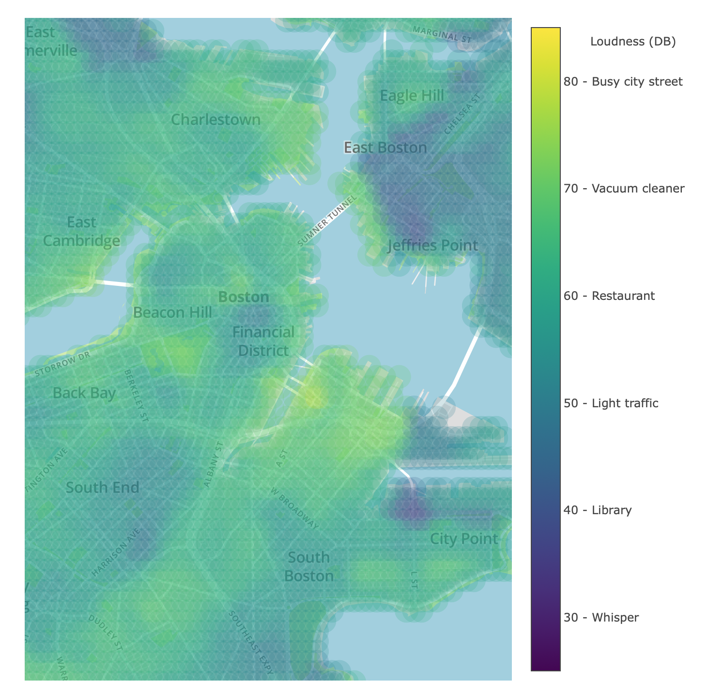
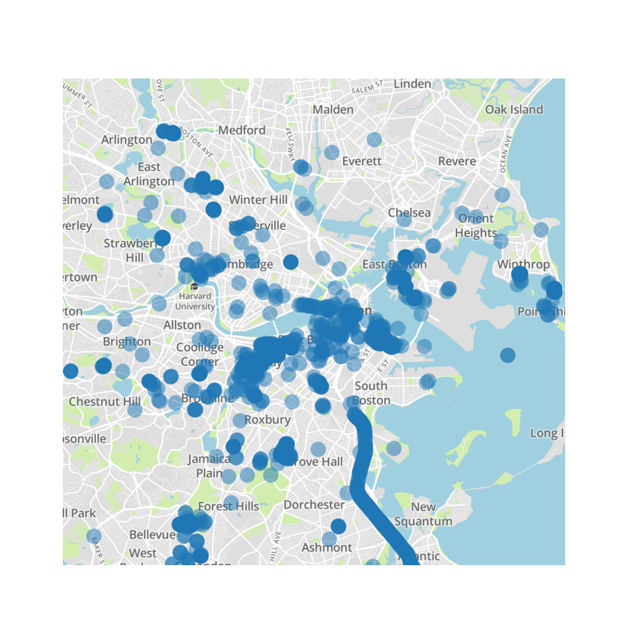

# NoiseMap
This project predicts noise levels at different times of day around Boston, MA. I deployed these predictions as an interactive app, where you can see a map of noise estimates at different times of day and on weekdays and weekends, and search for the quietest park within 2 miles. A screen shot of the map is shown below.
[The web-app can be found here](http://noisemap.me/)

## Overview
I used data from two different citizen-science smartphone apps, [NoiseTube](http://www.noisetube.net/), and [NoiseScore](http://noisescore.com). The NoiseTube data is publicly available through an [API](http://www.noisetube.net/api_overview). The NoiseScore data was shared with me by [Dr. Erica Walker](http://noiseandthecity.org/erica-walker/), who leads the development of the NoiseScore app. You can read more about her work at [Noise and the City](http://noiseandthecity.org). The map below shows the spread of noise-observations over the city. These data provide good coverage, but there are still many areas for which we do not have noise-level information.

Using these data, I developed a random-forest regressor model to predict noise levels accross the city, at different times of day and on weekdays and weekends. I used data from the [Massachusetts government](https://www.mass.gov/orgs/massgis-bureau-of-geographic-information) and [Yelp](https://www.yelp.com/developers) on the locations of:

- Police & fire stations,
- Hospitals,
- Roads & highways,
- Trains, subways & buses,
- Restaurants & bars.

I then used this model to generate predictions for the rest of the map, at different times of day. I deployed these predictions as a web app, using Dash. Using the app, you can see a map of noise estimates at different times of day and on weekdays and weekends, and search for the quietest park within 2 miles.

## Structure
This repository contains the data, scripts used for data scraping and processing, feature engineering, modeling, and the code for the web-app. The structure of the repository is as follows:

1. Data Processing - contains scripts used to pull in data from NoiseTube, and Yelp, and specify the shape of the coastline and rivers to crop out these areas from the final map of predictions. (I decided to exclude these areas from model predictions, because there were no noise-level observations from water.)

2. Data Merge - contains scripts used for feature engineering. For each noise observation, I calculated minimum distances to each of the predictor features, and radial counts (e.g., the distance to the nearest restaurant or bar, and the number of restaurants and bars within 25 m, 50 m, 100 m, 200 m, 250 m, 300 m, 500 m, 1000 m). I also calculated these values for an evenly spaced grid of points on the map, so that after I trained my model on the noise observations, I could generate predictions for the rest of the map.

3. Modeling - contains notebooks used to train and validate the model, and scripts used to generate predictions. The notebook pickles and saves trained model, so that separate scripts can load the trained model and make predictions for the rest of the map.

4. Dash - the code and model predictions used for the web app.

5. Git Figures - figures used in this ReadMe.

The NoiseScore data are not currently public, so at present these data are not shared in this repository.